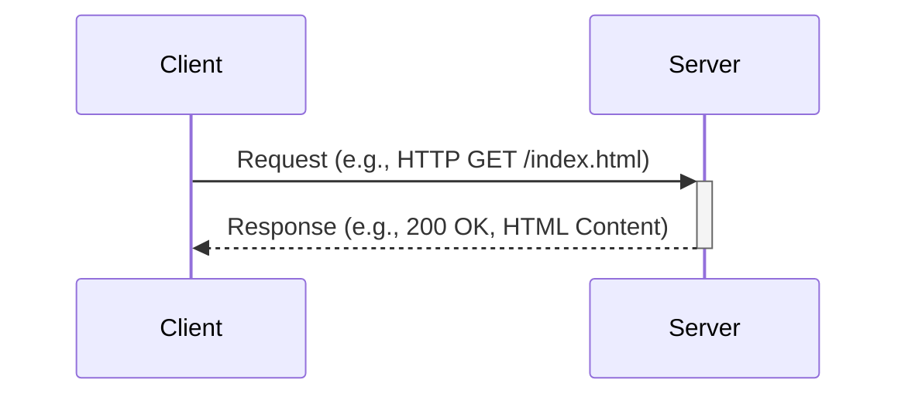

# Wireless-Weather-Station-
..

```mermaid
sequenceDiagram
    participant Client
    participant Server
    Client->>+Server: Request (e.g., HTTP GET /index.html)
    Server-->>-Client: Response (e.g., 200 OK, HTML Content)
```
